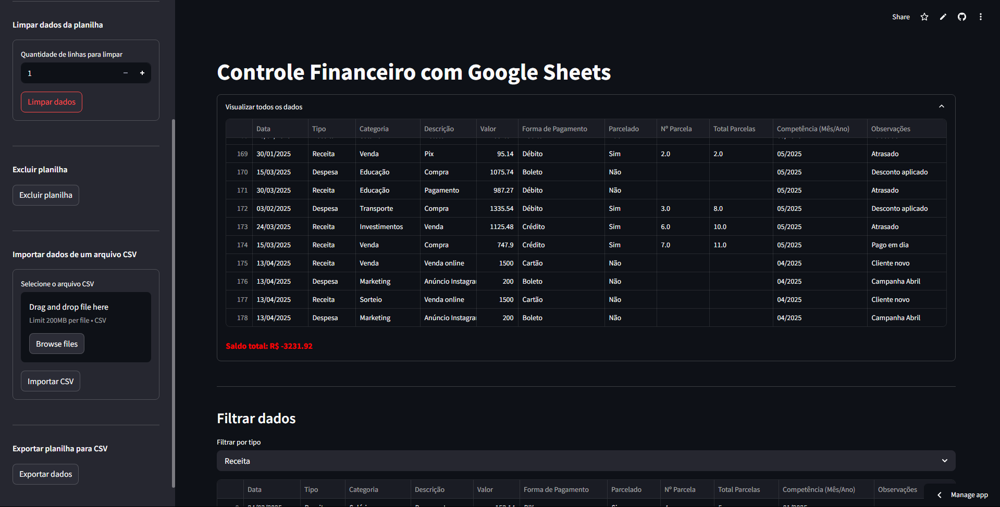

# Portfólio de Murilo Nunes

Bem-vindo ao meu portfólio! Sou Murilo Nunes, um desenvolvedor Backend sempre em busca de evolução e novos desafios. Aqui você encontrará alguns dos meus projetos, as tecnologias que utilizo, e um pouco sobre mim.

## Sobre Mim

Sou um desenvolvedor que acredita no crescimento contínuo, sempre buscando a evolução através da prática e aprendizado. Atualmente, estou trabalhando com as tecnologias Python, Flask, MySQL, Streamlit, entre outras.

## Projetos

Aqui estão alguns dos projetos que desenvolvi:

### 1. [CRUD Completo com Flask, MySQL, HTML e CSS](https://github.com/Murilonuness/Flask-Web-Crud-Mysql)
Um projeto completo com registro, login e uma página administrativa privada. Este é um sistema CRUD básico que usa Flask no backend e MySQL no banco de dados.

### 2. [Controle Financeiro com Streamlit e Google Sheets](https://github.com/Murilonuness/ToDo-List-com-Flask)
Aplicação que usa a API Google Sheets para gerenciar finanças pessoais com Streamlit.

### 3. [Atualização de Dados com Streamlit](https://github.com/Murilonuness/jsonCrud-Streamlit)
Uma aplicação para manipulação de dados armazenados em arquivos `.json`, utilizando Streamlit e Pandas.

### 4. [Final Exodus](https://github.com/Murilonuness/Final-Exodus)  
Jogo criado com Python e com a biblioteca Pygame.  
[Assista ao vídeo de demonstração no YouTube](https://www.youtube.com/watch?v=yhymvDdb1yE)  

### 5. [Estudos de Lógica com Python](https://github.com/Murilonuness/Estudos-de-Logica-e-Python)
Uma coleção de exercícios lógicos autodidatas em Python.

### 6. [Ecommerce Terminal](https://github.com/Murilonuness/ecommerce-Terminal)
Um sistema de Ecommerce pelo terminal, utilizando Mysql, JWT e Werkzeug Security.

## Tecnologias

Aqui estão algumas das tecnologias que utilizo em meus projetos:

- **Python**
- **Flask**
- **MySQL**
- **Streamlit**
- **Pandas**
- **HTML5**
- **CSS3**
- **Git**
- **Google Sheets API**

## Contato

Você pode entrar em contato comigo através dos seguintes canais:

- [GitHub](https://github.com/Murilonuness)
- [Telegram](https://t.me/murilonunes)
- [WhatsApp](https://wa.me/+5515991227119)

## Licença

Este projeto está licenciado sob a [MIT License](LICENSE).
